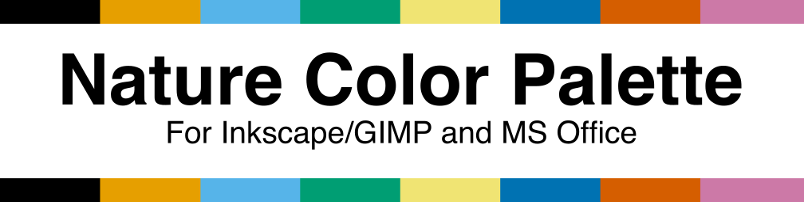
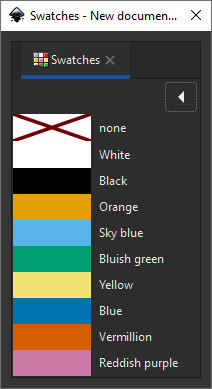

# Nature Color Palette

  

Inkscape/GIMP color palette optimized for color-blind individuals

## What's this?

Many academic journals request to use colors in artworks with consideration for color-blindness.
Some nature journals recommend in the author guide to use color optimized for color-blind individuals

This color palette is a GIMP/Inkscape color palette based on it.

### This palette contains...

### The original material is...

* Wong, B. Points of view: Color blindness. Nat Methods 8, 441 (2011). https://doi.org/10.1038/nmeth.1618

## Usage (in case of Inkscape)
1. Download the newest version in [release page](https://github.com/atsuyaw/NatureColorPalette/releases) and find out  `NatureColorPalette.gpl`.
1. You should place the `*.gpl` file into `C:\Program Files\Inkscape\share\inkscape\palettes`.
1. Launch Inkscape and click `[View]` / `[Swatches...]` on the menu bar.
1. You can choose `nature color palette` and use it.
