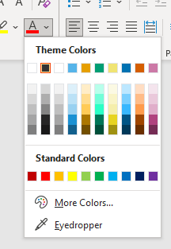

# Nature Color Palette

  
     
 

Microsoft Office and Inkscape/GIMP color palette optimized for color-blind individuals

## What's this?

Many academic journals request to use colors in artworks with consideration for color-blindness.
Some nature journals recommend in the author guide to use color optimized for color-blind individuals

This color palette is a GIMP/Inkscape color palette based on it.

### This palette contains...

### The original material is...

* Wong, B. Points of view: Color blindness. Nat Methods 8, 441 (2011). https://doi.org/10.1038/nmeth.1618

## Instration for MS Office
1. Download the newest version in [release page](https://github.com/atsuyaw/NatureColorPalette/releases) and find out  `NatureColorPalette.xml`.
1. Place the `*.xml` file into `%AppData%\Roaming\Microsoft\Templates\Document Themes\Theme Colors`
1. Launch MS Word/Excel/PowerPoint and apply `NatureColorPalette` color theme.
1. You can use the color palette:  

## Instration for Inkscape
1. Download the newest version in [release page](https://github.com/atsuyaw/NatureColorPalette/releases) and find out  `NatureColorPalette.gpl`.
1. Place the `*.gpl` file into `%ProgramFiles%\Inkscape\share\inkscape\palettes`.
1. Launch Inkscape and click `[View]` / `[Swatches...]` on the menu bar.
1. You can choose `nature color palette` and use it.
